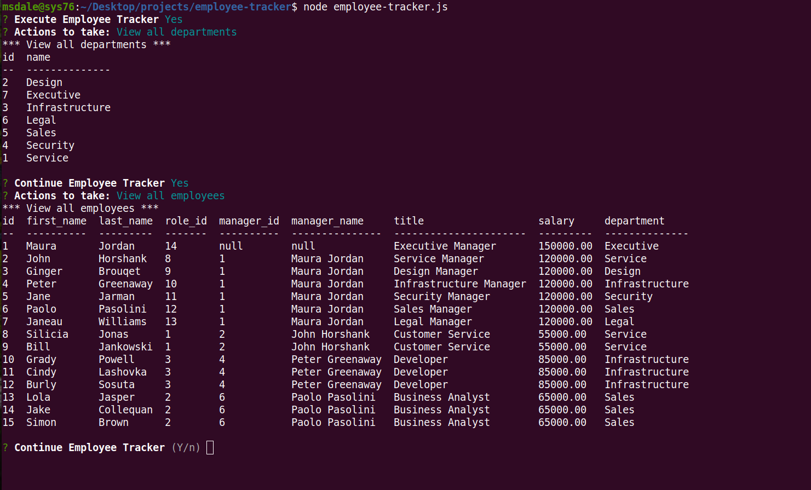

# employee-tracker 

## Description

A node-based CLI app for managing employee roles and accountabilities.

## Table Of Contents

- [employee-tracker](#employee-tracker)
  - [Description](#description)
  - [Table Of Contents](#table-of-contents)
  - [Installation](#installation)
  - [Usage](#usage)
  - [Questions](#questions)

## Installation

To install locally, clone this repository to your local environment.  This is a node application, so node must be installed.  MySQL must also be installed locally.  For mySQL installation see https://dev.mysql.com/doc/refman/8.0/en/installing.html  If you need to install node, check out this link  https://nodejs.org/en/download/.  Once mySQL and node (and npm) are installed, attach to the repository root directory and update npm dependencies with the following command:

* npm install jest express mysql2 inquirer console.table

Additionally you must execute the first 2 database initialization scripts.  Attach to the root directory of the repository and connect to mySQL, then type the source commands...

mysql> source db/db.sql

mysql> source db/schema.sql

mysql> source db/seeds.sql        (optional)

The first 2 are required INITIALLY.  The last, db/seeds.sql, provides some initial test data.

THE FIRST 2 SQL SCRIPTS SHOULD ONLY BE RUN TO RE-INITIALIZE THE MYSQL DATABASE AS A FIRST-TIME SETUP.  Or they can be run to restart from the beginning, as part of a test scenario.

See demo of the installation process below...

https://user-images.githubusercontent.com/90280725/148718689-3f711837-cc06-472f-9d59-8fcdffc75c02.mp4

## Usage

To execute the application, from the root directory of the cloned repository, type the following:

node empoyee-tracker.js

OR

npm start

Follow the command-line prompts...

See the following demo...

https://user-images.githubusercontent.com/90280725/148714162-c196bb59-d0ca-49d6-bc31-7c4bcb4b669c.mp4

## Questions

Any questions, please contact Mark Dale.

My email address is: msdaledad@gmail.com
My github profile is https://github.com/msdale
